<div align="center">
  <a href="https://oktech.jp">
    
  </a>

<h1>
  <a href="https://oktech.jp">OKTech.jp Website</a>
</h1>
  <p>OKTech Technology Meetup Group in Osaka, Kyoto, Kansai (formerly OWDDM and KWDDM).</p>
</div>

---

## Overview

This project is a Static Site Generator website, built with Astro 5, TypeScript, React, Tailwind, and Daisy UI.

It is hosted on GitHub Pages, available at [oktech.jp](https://oktech.jp).

## Development Environment

The recommended way to develop is to launch the provided [Dev Container](.devcontainer/devcontainer.json) (see [containers.dev](https://containers.dev/)) which provides a Node 22 environment.

Install dependencies and run common tasks with the following commands (see [package.json](./package.json) for all scripts):

```bash
npm install # or npm ci
npm run dev # starts the development server
npm run build # builds the SSG website
npm run preview # previews the SSG website
npm run checks # checks types, lints, and prunes code
npm run test # runs the tests (playwright)
```

See [./AGENTS.md](./AGENTS.md) for automation tips, code-style expectations, and task-specific checklists.

## Content

Primary content lives in `content/` and syncs with upstream data from [oktechjp/public](https://github.com/oktechjp/public).

- [./content/events](./content/events) are synced automatically by the import [workflow](#workflows).
- [./content/venues](./content/venues) and [./content/articles](./content/articles) are added manually.

## Workflows

For now, most of the time, event content and photos should only be edited in the [oktechjp/public](https://github.com/oktechjp/public) repository. This will trigger a [scheduler](.github/workflows/scheduler.yml) workflow that [imports](.github/workflows/import.yml) and commits the changes, and triggers a [build](.github/workflows/astro.yml) that that gets deployed to GitHub Pages.

```mermaid
flowchart LR
    %% External Triggers
    Cron([Daily Cron<br/>15:00 UTC])
    ManualScheduler([Manual Dispatch<br/>scheduler.yml])
    ManualImport([Manual Dispatch<br/>import.yml])
    ManualBuild([Manual Dispatch<br/>astro.yml])
    Upstream([Upstream Commit<br/>oktechjp/public])
    DirectPush([Direct Push<br/>to main])

    subgraph scheduler["scheduler.yml"]
        direction LR
        Scheduler[[Scheduler Workflow]]
        CheckMeta[Read content/meta.json<br/>commitHash, contentHash,<br/>nextEventEnds]
        FetchUpstream[Fetch latest commit<br/>from oktechjp/public]
        CheckEvent{Event ended?}
        CompareCommit{Commit hash changed?}
        FetchContent[Fetch events.json<br/>& photos.json]
        ComputeHash[Compute content hash<br/>SHA256]
        CompareHash{Content hash changed?}
        TriggerImport[Dispatch import.yml]
        End1(End)

        Scheduler --> CheckMeta --> FetchUpstream --> CheckEvent
        CheckEvent -->|Yes| TriggerImport
        CheckEvent -->|No| CompareCommit
        CompareCommit -->|Yes| FetchContent --> ComputeHash --> CompareHash
        CompareCommit -->|No| End1
        CompareHash -->|Yes| TriggerImport
        CompareHash -->|No| End1
    end

    subgraph import["import.yml"]
        direction LR
        Import[Import Workflow]
        SetupAndRestoreNodeCache[[Setup Node 22<br/>restore node_modules cache]]
        RunImport[Run npm import script<br/>fetch oktechjp/public]
        SaveNodeCache[[Save node_modules cache<br/>for next runs]]
        UpdateMeta[Update content/meta.json<br/>with commit & hashes]
        CheckChanges{Content changes?}
        CommitPush[Commit & push<br/>to main branch]
        TriggerBuild[Dispatch astro.yml]
        End2(End)

        Import --> SetupAndRestoreNodeCache --> RunImport --> SaveNodeCache --> UpdateMeta --> CheckChanges
        CheckChanges -->|Yes| CommitPush
        CheckChanges -->|No| End2
        CommitPush --> TriggerBuild
    end

    subgraph build["astro.yml"]
        direction LR
        Build[Build Workflow]
        SetupAndRestoreNodeBuild[[Setup Node 22<br/>restore node_modules cache]]
        RestoreAstroCache[[Restore Astro asset cache]]
        BuildAstro[Build Astro site]
        RunTests[Run npm run test:dist]
        TestsPassed{Tests pass?}
        SaveNodeBuild[[Save node_modules cache]]
        SaveAstroCache[[Save Astro cache<br/>per run]]
        Deploy[Upload to Github Pages]
        End3(End)

        Build --> SetupAndRestoreNodeBuild --> RestoreAstroCache --> BuildAstro --> RunTests --> TestsPassed
        TestsPassed -->|Yes| SaveNodeBuild --> SaveAstroCache --> Deploy --> End3
        TestsPassed -->|No| End3
    end

    %% Cross-workflow connections
    Cron --> Scheduler
    ManualScheduler --> Scheduler
    Upstream --> Scheduler
    TriggerImport --> Import
    ManualImport --> Import
    TriggerBuild --> Build
    ManualBuild --> Build
    DirectPush --> Build

    %% Shared cache resources
    NodeModulesCacheImport[(Shared node_modules<br/>+ browser caches)]
    NodeModulesCacheBuild[(Shared node_modules<br/>+ browser caches)]
    AstroAssetCache[(Astro asset cache)]

    NodeModulesCacheImport --> SetupAndRestoreNodeCache
    SaveNodeCache --> NodeModulesCacheImport
    NodeModulesCacheBuild --> SetupAndRestoreNodeBuild
    SaveNodeBuild --> NodeModulesCacheBuild
    NodeModulesCacheImport -.-> NodeModulesCacheBuild
    AstroAssetCache --> RestoreAstroCache
    SaveAstroCache --> AstroAssetCache

    %% Subgraph styling
    style scheduler fill:transparent,stroke:#4b5563,stroke-width:3px,rx:12,ry:12
    style import fill:transparent,stroke:#4b5563,stroke-width:3px,rx:12,ry:12
    style build fill:transparent,stroke:#4b5563,stroke-width:3px,rx:12,ry:12

    %% Styling with border colors that work in light and dark mode
    classDef triggerStyle stroke:#3b82f6,stroke-width:3px
    classDef workflowStyle stroke:#4b5563,stroke-width:3px
    classDef decisionStyle stroke:#a855f7,stroke-width:2px
    classDef actionStyle stroke:#10b981,stroke-width:2px
    classDef endpointStyle stroke:#ec4899,stroke-width:2px
    classDef cacheStyle stroke:#facc15,stroke-width:2px
    classDef cacheResourceStyle stroke:#facc15,stroke-width:3px

    class Cron,ManualScheduler,ManualImport,ManualBuild,Upstream,DirectPush triggerStyle
    class Scheduler,Import,Build workflowStyle
    class CheckEvent,CompareCommit,CompareHash,CheckChanges,TestsPassed decisionStyle
    class SetupAndRestoreNodeCache,SaveNodeCache,SetupAndRestoreNodeBuild,RestoreAstroCache,SaveNodeBuild,SaveAstroCache cacheStyle
    class NodeModulesCacheImport,NodeModulesCacheBuild,AstroAssetCache cacheResourceStyle
    class CheckMeta,FetchUpstream,FetchContent,ComputeHash,TriggerImport,InstallDeps,RunImport,UpdateMeta,CommitPush,TriggerBuild,SetupPages,InstallOrCi,PrintEnv,BuildAstro,InstallBrowsers,RunTests,UploadArtifact,Deploy actionStyle
    class End1,End2,End3 endpointStyle
```



## Import Script Overview

You can also manually run the import script within a dev environment. See
[./scripts/import-data/README.md](./scripts/import-data/README.md) for invocation details, required environment variables, and troubleshooting steps. Use `npm run import -- --help` to see all options.

## Tests

- Playwright-based tests live under `test/`.
- `npm run test:dev` runs against the dev server; `npm run test:build` builds first and then tests; `npm run test:dist` test an existing build and is used in CI.
- Install browsers with `npx playwright install --with-deps` if they are missing and keep fixtures in sync with layout changes.

## Contributing

- Review the Style Guide in `./AGENTS.md` before starting work.
- Fork the repository, create a feature branch, and open a pull request with passing `npm run checks` and relevant tests.

## Artificial Intelligence (AI) and Large Language Model (LLM) Disclosure

This project was created with the assistance of AI development tools including Cursor IDE, Claude Code, Codex CLI, and others, utilizing various models throughout the development of this project since its start in April 2025. Thank you to all who made it possible.
