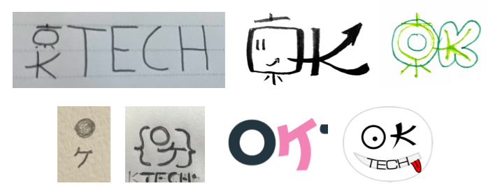
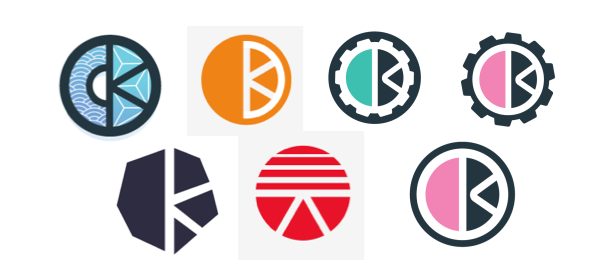

The OKTech Logo was designed in collaboration by [Sacha Greif](#sacha-greif), [Gary Wintle](#gary-wintle) and [Chris](#chris).

The Design followed a process organized by [Karim](#karim) between May and August 2025.

| Variant             | Preview | CYMK-`.svg`* | RGB-`.svg` | `.png` |
|---------------------|---------|--------------|------------|--------|
| On light background |  | [`.svg`](https://public.oktech.jp/images/logo-and-design/OKTech-logo-onlight.svg) | [`.svg`](https://public.oktech.jp/images/logo-and-design/OKTech-logo-onlight-rgb.svg) | [`.png`](https://public.oktech.jp/images/logo-and-design/OKTech-logo-onlight.png)/[`@2x`](https://public.oktech.jp/images/logo-and-design/OKTech-logo-onlight@2x.png)/[`@4x`](https://public.oktech.jp/images/logo-and-design/OKTech-logo-onlight@4x.png) |
| On dark background  |  | [`.svg`](https://public.oktech.jp/images/logo-and-design/OKTech-logo-ondark.svg) | [`.svg`](https://public.oktech.jp/images/logo-and-design/OKTech-logo-ondark-rgb.svg) | [`.png`](https://public.oktech.jp/images/logo-and-design/OKTech-logo-ondark.png)/[`@2x`](https://public.oktech.jp/images/logo-and-design/OKTech-logo-ondark@2x.png)/[`@4x`](https://public.oktech.jp/images/logo-and-design/OKTech-logo-ondark@4x.png) |
| Black               |  | | [`.svg`](https://public.oktech.jp/images/logo-and-design/OKTech-logo-black.svg) | [`.png`](https://public.oktech.jp/images/logo-and-design/OKTech-logo-black.png)/[`@2x`](https://public.oktech.jp/images/logo-and-design/OKTech-logo-black@2x.png)/[`@4x`](https://public.oktech.jp/images/logo-and-design/OKTech-logo-black@4x.png) |
| White               |  | | [`.svg`](https://public.oktech.jp/images/logo-and-design/OKTech-logo-white.svg) | [`.png`](https://public.oktech.jp/images/logo-and-design/OKTech-logo-white.png)/[`@2x`](https://public.oktech.jp/images/logo-and-design/OKTech-logo-white@2x.png)/[`@4x`](https://public.oktech.jp/images/logo-and-design/OKTech-logo-white@4x.png) |
| Auto-Dark/Light     |  | [`.svg`](/images/logo-and-design/OKTech-favicon.svg)  |

* CMYK-`.svg`s contain CYMK colors. If your editor happens to not support it, use the RGB variant.

## Colors

Colors are softened versions of the [RGB Color Model](https://en.wikipedia.org/wiki/RGB_color_model) with a tinted gray for the light content.

| Color | RGB     | CYMK                | [OKLCH][] |
|-------|---------|---------------------|-----------|
| Dark  | #2a2b36 | 77% 72% 53% 57%     | 0.2928 0.02 281 |
| Black | #000000 | 100% 100% 100% 100% | 0.0141 0 281 |
| White | #ffffff | 0 0 0 0             | 1 0 281 |
| Red   | #fd4d69 | 0 83% 43% 0         | 0.6745 0.211 15.93 |
| Green | #49d773 | 58% 0 80% 0         | 0.7802 0.185 149.54 |
| Blue  | #459bc9 | 69% 26% 7% 0        | 0.6562 0.107 235.11 |

### Complementary colors

The following colors are in the space between red/green/blue and can be used to complement designs and have visual contrast.

| Color    | RGB     | CYMK                | [OKLCH][] |
|----------|---------|---------------------|-----------|
| Ocre     | #da9a00 | 0 36% 129% 31%      | 0.7293 0.152 78.91 |
| Turqoise | #00bfbb | 227% 0 2% 42%       | 0.7271 0.1248 192.1 |
| Violett  | #ac77e1 | 34% 54% 0 30%       | 0.6663 0.1595 305.58 |

[OKLCH]: https://oklch.com/

## Symbol

| Variant                   | Preview | CYMK-`.svg`* | RGB-`.svg` | `.png` |
|---------------------------|---------|--------------|------------|--------|
| On light background       |  | [`.svg`](https://public.oktech.jp/images/logo-and-design/OKTech-symbol-onlight.svg) | [`.svg`](https://public.oktech.jp/images/logo-and-design/OKTech-symbol-onlight-rgb.svg) | [`.png`](https://public.oktech.jp/images/logo-and-design/OKTech-symbol-onlight.png)/[`@2x`](https://public.oktech.jp/images/logo-and-design/OKTech-symbol-onlight@2x.png)/[`@4x`](https://public.oktech.jp/images/logo-and-design/OKTech-symbol-onlight@4x.png) |
| On dark background        |  | [`.svg`](https://public.oktech.jp/images/logo-and-design/OKTech-symbol-ondark.svg) | [`.svg`](https://public.oktech.jp/images/logo-and-design/OKTech-symbol-ondark-rgb.svg) | [`.png`](https://public.oktech.jp/images/logo-and-design/OKTech-symbol-ondark.png)/[`@2x`](https://public.oktech.jp/images/logo-and-design/OKTech-symbol-ondark@2x.png)/[`@4x`](https://public.oktech.jp/images/logo-and-design/OKTech-symbol-ondark@4x.png) |
| Black                     |  | | [`.svg`](https://public.oktech.jp/images/logo-and-design/OKTech-symbol-black.svg) | [`.png`](https://public.oktech.jp/images/logo-and-design/OKTech-symbol-black.png)/[`@2x`](https://public.oktech.jp/images/logo-and-design/OKTech-symbol-black@2x.png)/[`@4x`](https://public.oktech.jp/images/logo-and-design/OKTech-symbol-black@4x.png) |
| White                     |  | | [`.svg`](https://public.oktech.jp/images/logo-and-design/OKTech-symbol-white.svg) | [`.png`](https://public.oktech.jp/images/logo-and-design/OKTech-symbol-white.png)/[`@2x`](https://public.oktech.jp/images/logo-and-design/OKTech-symbol-white@2x.png)/[`@4x`](https://public.oktech.jp/images/logo-and-design/OKTech-symbol-white@4x.png) |
| Auto-Dark/Light (Favicon) |  | [`.svg`](https://public.oktech.jp/images/images/logo-and-design/OKTech-favicon.svg) |  | |
| Incl. White background    |  | [`.svg`](https://public.oktech.jp/images/logo-and-design/OKTech-symbol-onwhite.svg)  | [`.svg`](https://public.oktech.jp/images/logo-and-design/OKTech-symbol-onwhite-rgb.svg) | [`.png`](https://public.oktech.jp/images/logo-and-design/OKTech-symbol-onwhite.png)/[`@2x`](https://public.oktech.jp/images/logo-and-design/OKTech-symbol-onwhite@2x.png)/[`@4x`](https://public.oktech.jp/images/logo-and-design/OKTech-symbol-onwhite@4x.png) |

> The Symbol hides "O" in the outline of the circle while the 3 arrows pointing towards the center hide the "K" in the negative space.

## Interactive

In an interactive context it is okay to start off with an un-tilted version of the logo that becomes tilted.

## (Fav-)Icon

Icons are expected to be the symbol on light background. If a platform supports transparency use a non-transparent version on white as icon. If there is support for an alternate version as, supply symbols on transparent backgrounds.

Browsers with SVG support can use the prepared [favicon.svg](/images/logo-and-design/OKTech-favicon.svg) file.

## Text

Font: [Lexend](https://www.lexend.com/) Extra Bold ([Github](https://github.com/googlefonts/lexend))

| Variant                                  | Preview | `.svg` | `.png` |
|------------------------------------------|---------|--------|--------|
| On light background                      |  |[`.svg`](https://public.oktech.jp/images/logo-and-design/OKTech-text-onlight.svg) | [`.png`](https://public.oktech.jp/images/logo-and-design/OKTech-text-onlight.png)/[`@2x`](https://public.oktech.jp/images/logo-and-design/OKTech-text-onlight@2x.png)/[`@4x`](https://public.oktech.jp/images/logo-and-design/OKTech-text-onlight@4x.png)  |
| On dark background _(also just "white")_ |  |[`.svg`](https://public.oktech.jp/images/logo-and-design/OKTech-text-ondark-white.svg) | [`.png`](https://public.oktech.jp/images/logo-and-design/OKTech-text-ondark-white.png)/[`@2x`](https://public.oktech.jp/images/logo-and-design/OKTech-text-ondark-white@2x.png)/[`@4x`](https://public.oktech.jp/images/logo-and-design/OKTech-text-ondark-white@4x.png)  |
| Black                                    |  |[`.svg`](https://public.oktech.jp/images/logo-and-design/OKTech-text-black.svg) | [`.png`](https://public.oktech.jp/images/logo-and-design/OKTech-text-black.png)/[`@2x`](https://public.oktech.jp/images/logo-and-design/OKTech-text-black@2x.png)/[`@4x`](https://public.oktech.jp/images/logo-and-design/OKTech-text-black@4x.png)  |

### Complementary Font

For long texts and as contrast to Logo, we use [Noto Sans JP][] _(Regular)_.

[Noto Sans JP]: https://fonts.google.com/noto/specimen/Noto+Sans+JP?preview.text=OKTech%20is%20interesting.%20%E3%82%AA%E3%83%83%E3%82%B1%E3%83%BC%E3%81%A7%E3%81%99%E3%83%86%E3%83%83%E3%82%AF%E3%81%AF%E9%9D%A2%E7%99%BD%E3%81%84

### Source Code Font

In case we display source code or other monospaced content we use [Martian Mono][].

[Martian Mono]: https://fonts.google.com/specimen/Martian+Mono

### Katakana カナ

The kana variant of the name is "オッケーテック". 

## Creation Background

The name _"OKTech"_ was not just chosen for its literal reading _"OK! Let's work/talk/study/challenge technology!"_ but also to have a connection to the Kansai region with O standing for Osaka (大阪) and K for Kyoto (京都).

In the design process, various attempts have been made to try to integrate Kanji or Katakana (オケ).

However, [after a vote](https://app.opinionx.co/18ae0c0f-4665-430a-af13-4f50fa0e1000/survey) and deliberation we settled for the [Negative Space][] idea by [Gary](#gary-wintle). Then we worked out the current version after a few iterations:

[Negative Space]: https://en.wikipedia.org/wiki/Negative_space

## People

_(In alphabetical order)_

### Chris

Chris _("クリス。コム" in our Discord)_, joined the community and Osaka in 2024 and works actively on the first version of the OKTech homepage which first incorporated the Logo.

- [クリス.コム](https://xn--pckua0m.xn--tckwe/)
- [@Github](https://github.com/kurisu-dotto-komu)

### Gary Wintle

Gary _("gwintle" in our Discord)_, is a professional Illustrator and Animator who joined our community in 2025. He actively works on making websites more exciting using dynamic animations.

- [garywintle.com](https://garywintle.com/)
- [@Github](https://github.com/GaryWintle)
- [@LinkedIn](https://www.linkedin.com/in/gary-wintle-9168962/)
- [@Instagram](https://www.instagram.com/garywintle/)

### Karim

Karim _("greenstorm" in our Discord)_, moved to Kobe and joined our community in 2023 and became an active contributor with many years
in Tech under his belt. At time of writing Karim has been working as a general programmer.

- [@Github](https://github.com/greenstorm)
- [@LinkedIn](https://www.linkedin.com/in/abdulkarimx2/)

### Sacha Greif

Sacha _("sachag" in our Discord)_, living in Kyoto for many years, has been a transformative member of the Kansai's english speaking community.
Initially, very active in organizing the [HNKansai][] meetup. He is now actively working on global surveys of the tech broader community with [DevoGraphics][].

- [sachagreif.com](https://sachagreif.com)
- [@Bluesky](https://bsky.app/profile/sachagreif.com)
- [@Github](https://github.com/sachag)
- [@X](https://x.com/sachagreif)
- [@Instagram](https://www.instagram.com/sachagreif)
- [@LinkedIn](https://www.linkedin.com/in/sacha-greif-03b9a3255)

[HNKansai]: http://hnkansai.org
[DevoGraphics]: https://www.devographics.com

### Other contributors

Big thanks and many hugs to all other contributors to the design process, namely:

- [Roger Guldbrandsen](https://kinbiko.com/)
- [Asha McMullin](https://www.linkedin.com/in/asha-mcmullin-52b249131/)
- [Jacob Sullivan](https://www.linkedin.com/in/jacob-sullivan-31a364162/)
- [Evey Yeh](https://www.linkedin.com/in/pin-jia-y-78254a1b8/)
- [Martin Heidegger](https://github.com/martinheidegger)

## Links

Links to threads in our Disord server where the process happened in public.
([join here](https://owddm.com/discord))

- https://discord.com/channels/1034792577293094972/1377189765560139816
- https://discord.com/channels/1034792577293094972/1398927964548366418
