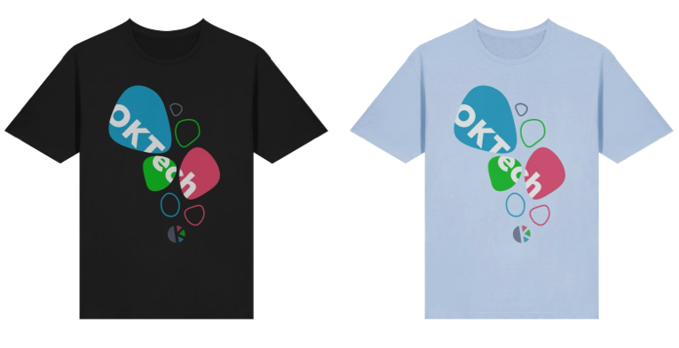
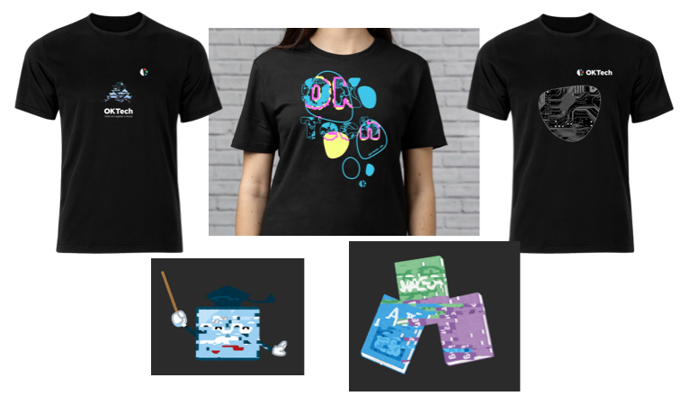

**👕 What about those T-shirts?**

For [the opening event of OKTech](/events/311083074-hello-oktech) our Volunteers worked together on a new T-Shirts!

## You can buy the T-Shirt now!

Initially, we just offered to get shirts at events with Sacha doing the back and forth communication. But since he is a busy father and the stars didn't align all the time, we decided to open a store!

**[→ OKTech Things Store](https://things.oktech.jp/products/oktech-shirt)**

#### Powered-by

[The store](https://things.oktech.jp/) is powered by [Fourthwall](https://fourthwall.com/) as it seems to be balancing both ease of setup and getting an Item (delivery/printing). They are reasonably low priced (~￥3,100) and we hope that works for you. If you wish a shirt but can't affort it, let us know!

Due to how Fourthwall works, it does require us to make a little bit of profit on each item (around ￥500) even though we are dedicatedly Non-Profit. If you know/want to help us make the a system that ends in no profit for us, please let us know, we are always open to help!

Any profit that we will make through Fourthwall will end up in our community wallet and will be used to offset costs for venues or snacks in the future.

## History

During the design process of the [OKTech Logo](/articles/logo-and-design) and the new website, we also wanted to get a T-Shirt the group. [In an open call on Discord](https://discord.com/channels/1034792577293094972/1415879036781068368/1415879045739974726) we collected a few designs, though mostly by Sacha.

Eventually we went with [Sacha Greif](#sacha-greif)'s design and it is decorating our Volunteers every since. 😉

## Future Items

Currently, we only have the T-Shirt as item in our shop. We are happy with this but maybe you would like to have other things in the shop as well. If you are member and would like to help out. [→ Join our Discord](/discord) and speak up! We will help you with the process.

## People

### Sacha Greif

Sacha _("sachag" in our Discord)_, living in Kyoto for many years, has been a transformative member of the Kansai's english speaking community.
Initially, very active in organizing the [HNKansai][] meetup. He is now actively working on global surveys of the tech broader community with [DevoGraphics][].

- [sachagreif.com](https://sachagreif.com)
- [@Bluesky](https://bsky.app/profile/sachagreif.com)
- [@Github](https://github.com/sachag)
- [@X](https://x.com/sachagreif)
- [@Instagram](https://www.instagram.com/sachagreif)
- [@LinkedIn](https://www.linkedin.com/in/sacha-greif-03b9a3255)