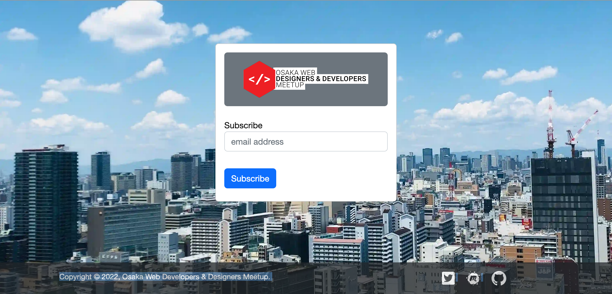
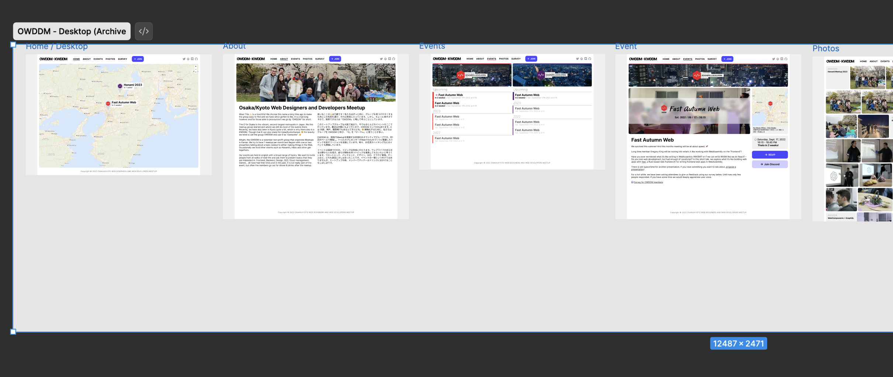
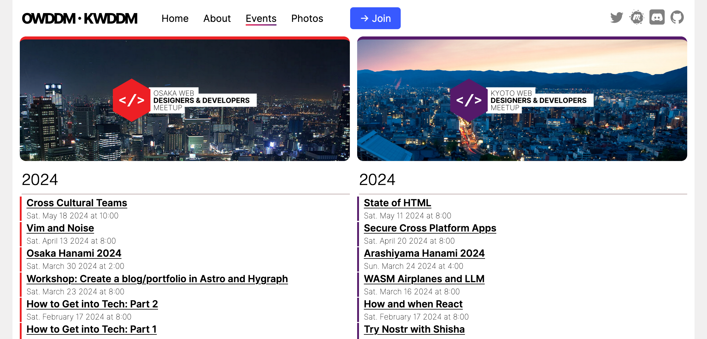
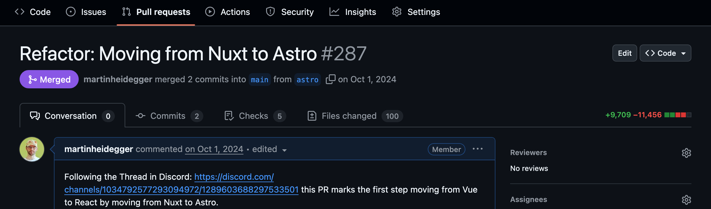
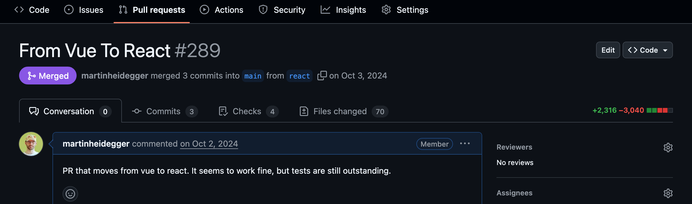
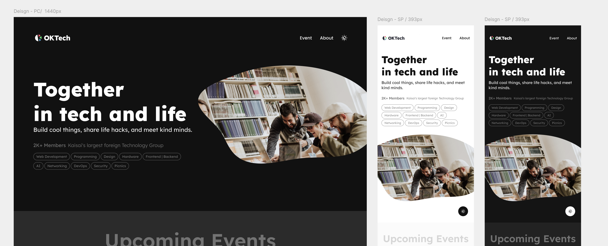
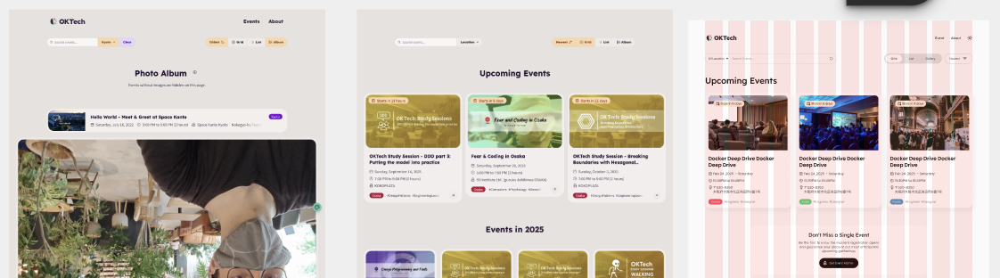

**👋 Hello Friend!**

Isn't this homepage nice? Well, it hasn't always been that way. Over the years many volunteers have laboured on it and you are about to learn why!

## Collaborative Playground

OKTech started out as Web Designers & Developers meetup. As such, many members aspire-to, or have web development skills.

As you can read in the history below, each step of the website came out of an interest for a topic or to learn something new.

If there is something that you want to learn or work on, **you too can use this as a playground**. Experiment together with us!

It offers a way for everyone involved, to practice collaboration in an international setting.

## History

#### Domain Hosting and DNS

The earliest version contained only a hosted domain and a redirect. It was part of a DNS presentation we've had, focussing on how to buy and setup a Domain.

##### Email List signup

In 2018 [Christian Oliff](https://github.com/coliff) held presentations on linting and in while the first homepage was rather rudimentary, it contained a quite extensive linting setup that even probably exceeds the current rules in place.

##### First proper website

After COVID, we started to gather our data outside of Meetup.com. With a collection of all our past events and a good set of photos, [Kimika](https://www.linkedin.com/in/kimika-m/) came up with a simple design for a meetup.

Quickly designed in Figma and the implemented using Vue by [Greg](https://www.linkedin.com/in/gregory-king-b858a194/) with [Martin](https://www.linkedin.com/in/leichtgewicht/) helping with the data preparation.

##### To Astro React

After our [Astro workshop](/events/292146517-astrobuild-workshop-by-tamas-piros), _Martin_ went on and moved the build system from nuxt to astro.

And in a subsequent PR, we also moved from Vue to React, which later was part of a presentation for [React Osaka](https://react-osaka.connpass.com/).

##### Hello OKTech

With our [new name "OKTech"](/articles/hello-oktech) in 2025 _(after initial prep work by [Traci](https://www.linkedin.com/in/destiny-simmons-2b010571/) and [Luna](https://www.linkedin.com/in/luna-katayama-92887b20/))_, parallel to the development of our [new Logo](https://oktech.jp/articles/logo-and-design#creation-background), [Evey](https://www.linkedin.com/in/pin-jia-y-78254a1b8/) created a new design for the page.

Over the months and with a lot of design input _Evey_ worked with great attention to detail.

That said, most of the effort for the first OKTech website was definitely done by [クリス。コム](https://xn--pckua0m.xn--tckwe/).

Not only was the first OKTech site made with support from AI Agents, but it also utilizes dark mode—even in the favicon. ICS calendars are a prominent feature; animations are present in many small places, and much more.

But all this is better explained in his presentation below ↓ 

<iframe src="./Hello_OKTech_dot_JP.pdf" width="100%" style="height: 23em;" aria-label="Hello OKTech PDF"></iframe>

## Join Us

The [GitHub Issue Tracker](https://github.com/oktechjp/oktech.jp/issues) is a good way to start. Also [Join us on Discord](/discord) and speak up to be added as Volunteer.
